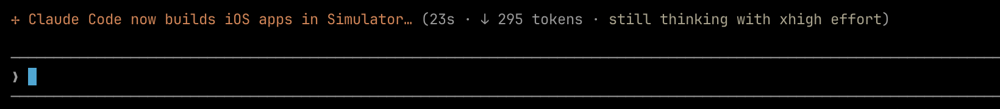

# spindle for Claude Code CLI

**A tiny tool that turns Claude Code's "thinking" spinner into a live developer-news ticker.**



You know the word Claude Code flashes while it thinks?

```
Meandering… (7m 33s · ↓ 27.2k tokens · thinking more with xhigh effort)
```

`spindle` swaps that word for a fresh developer-news headline, pulled from a
local cache:

```
Apple ships Swift 6.2… (7m 33s · ↓ 27.2k tokens · thinking more with xhigh effort)
```

No ads, no telemetry, no background process. The news sits in a local file, and **nothing of spindle's runs while
Claude is actually thinking.** 

---

## Install it

Prerequisites: **Python 3.8+**, **Claude Code 2.1.143 or newer**, and **git**.

Run:

```bash
curl -fsSL https://raw.githubusercontent.com/izhanali/spindle-claude-code/main/install.sh | bash
```

That's the whole install. It downloads spindle, grabs a first batch of news, and
wires itself into Claude Code.

Or clone it:

```bash
git clone https://github.com/izhanali/spindle-claude-code.git
cd spindle-claude-code
./install.sh
```

Then **start a new Claude Code session** — the next time it thinks, you'll see news.

---

## What just happened?

The installer did three small, fully reversible things:

1. Put a `spindle` command on your PATH (a symlink in `~/.local/bin`).
2. Downloaded ~60 recent developer-news headlines into a local cache
   (`~/.cache/spindle`).
3. Added **two keys** to your `~/.claude/settings.json`: the headlines
   (`spinnerVerbs`) and a tiny startup hook that keeps them fresh. Everything
   else already in that file is left exactly as it was.

If `~/.local/bin` isn't on your PATH yet, the installer prints the one line to
add to your shell profile.

---

## How you actually use it

Here's the best part: **you don't have to do anything.** Just use Claude Code
the way you always do. The next time it pauses to think, the spinner shows news
instead of a random word. Start a new session and you get the next batch. 

### A handful of commands (optional)

You'll rarely need these — the startup hook keeps everything fresh on its own —
but they're there when you want them:

| Command | What it does |
|---|---|
| `spindle status` | show what's cached and what's queued for the spinner |
| `spindle refresh` | pull fresh news right now |
| `spindle reset` | restart the rotation (make everything eligible again) |
| `spindle uninstall` | remove spindle completely |
| `spindle version` | print the version |

---

## FAQ

**Will this slow Claude down?**
No. While Claude thinks, *nothing of spindle's is running* — Claude is just
reading a few words it loaded once at startup. spindle's only work is a fast,
local settings write when a session begins, plus an occasional news refresh in
the background.

**Is it going to mess with my Claude settings?**
It adds two keys (`spinnerVerbs` and one `SessionStart` hook) and touches nothing
else. `spindle uninstall` removes exactly those two and leaves the rest of your
`settings.json` alone.

**Do I need an API key?**
Nope. Out of the box it reads free, public feeds (Hacker News, Reddit, and a set
of RSS feeds) — no accounts, no keys. Keys are only for the optional extras below.

**Where does the news come from? Can I pick my own topics?**
By default: mobile + general dev feeds (iOS, Android, Swift, Kotlin, Flutter,
React Native, plus AI/LLMs, Python, DevOps, and friends). All of it is
configurable — see [Make it yours](#make-it-yours).

**Does it phone home?**
No telemetry, ever. The only network it does is fetching public news feeds, and
only during a refresh — never while Claude is thinking.

**How do I turn it off?**
`spindle uninstall`, then start a new session. 

---

## Make it yours

spindle runs with zero configuration, but it's built to be fiddled with. Drop a
config file here:

```bash
mkdir -p ~/.config/spindle
cp config.example.toml ~/.config/spindle/config.toml   # from your clone
```

`config.example.toml` is fully commented — open it and every knob is explained.


- **`topics`** — the keywords spindle ranks news by. Point them at *your* stack.
- **`[[rss]]`** — add or drop feeds. Only want Rust news? Only your favorite
  blogs? Rewrite the list.
- **`[hackernews]` / `[reddit]`** — tune score thresholds or swap subreddits.
- **`pool_size`** — how many headlines are in play each session (default 14).

Two optional upgrades:

**Sharper headlines with AI.** Raw feed titles are often long and truncate
mid-word. Give spindle an OpenAI key and a cheap model (`gpt-4o-mini`) rewrites
each one into a tight phrase — once, during refresh, then cached forever, so it
never costs anything while Claude renders. No key? This simply doesn't happen and
everything else works fine.

```bash
cp .env.example .env      # then paste your key after OPENAI_API_KEY=
```

**More sources via news APIs.** Set `mode = "api"` to pull from NewsAPI + GNews +
DEV.to instead of the scraper feeds. NewsAPI and GNews want free keys; DEV.to and
Hacker News don't. spindle respects each API's free-tier daily limit
automatically, so you won't blow through a quota.

Every option, with defaults, is in the commented `config.example.toml` and in
[Under the hood](#under-the-hood-for-the-curious).

---

## Under the hood (for the curious)

<details>
<summary><b>Project layout &amp; installing as a package</b></summary>

```
spindle-claude-code/
├── bin/spindle                 # zero-install launcher (symlinked onto PATH)
├── install.sh                  # curl- or checkout-installer: symlink + seed + hook
├── pyproject.toml              # optional `pip install .` / pipx (console script)
├── config.example.toml         # fully annotated config
├── .env.example                # secrets template (API keys)
├── LICENSE                     # MIT
└── src/spindle/
    ├── __main__.py             # CLI entry point
    ├── config.py               # TOML load + defaults
    ├── model.py                # RawItem / Story dataclasses
    ├── util.py                 # width-aware truncate, url norm, similarity
    ├── http.py                 # conditional GET + JSON POST, never raises
    ├── summarizer.py           # optional cheap-LLM headline compression
    ├── storage.py              # atomic JSON cache
    ├── history.py              # rotation window
    ├── normalizer.py           # RawItem → Story
    ├── deduplicator.py         # url + title-similarity dedup
    ├── scorer.py               # weighted ranking
    ├── integration.py          # settings.json merge (the renderer hook)
    ├── pipeline.py             # refresh / sync / session-start orchestration
    └── fetcher/
        ├── __init__.py         # aggregation + FetchContext
        ├── common.py           # shared fetch helpers
        ├── hn.py               # Hacker News (Algolia; both modes)
        ├── api/                # api mode: keyed sources
        │   ├── newsapi.py
        │   ├── gnews.py
        │   └── devto.py
        └── scraper/            # scraper mode: no-auth sources
            ├── rss.py          # RSS 2.0 / Atom
            └── reddit.py       # Reddit (hot.json)
```

There's **no build** — `bin/spindle` runs straight from the checkout. If you'd
rather install it as a proper console script:

```bash
pipx install .          # isolated, adds `spindle` to PATH
# or
pip install --user .    # adds the `spindle` console script
```

Re-run `spindle install` afterward so the hook points at the new executable path
(`spindle status` shows the current hook command). To keep the cache warm without
relying on the on-stale refresh, add a cron entry:

```cron
*/30 * * * * $HOME/.local/bin/spindle refresh
```

Config discovery order: `--config PATH` → `$SPINDLE_CONFIG` →
`$SPINDLE_HOME/config.toml` → `~/.config/spindle/config.toml`.

</details>

---

## License

MIT — see [LICENSE](LICENSE).
