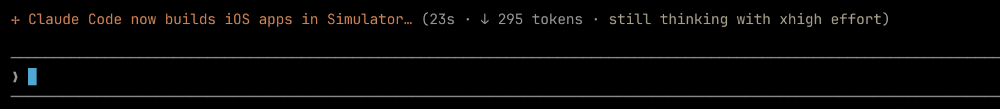

# spindle: a plugin for Claude Code CLI

**Turns Claude Code's "thinking" spinner into a live developer-news ticker.**



You know the word Claude Code flashes while it thinks?

```
Meandering… (7m 33s · ↓ 27.2k tokens · thinking more with xhigh effort)
```

`spindle` swaps that word for a fresh developer-news headline, pulled from a
local cache:

```
Apple ships Swift 6.2… (7m 33s · ↓ 27.2k tokens · thinking more with xhigh effort)
```

No ads, no telemetry, no API keys, no daemon. The news sits in a local file,
and **nothing of spindle's runs while Claude is actually thinking.**

---

## Where it works

spindle works in the **Claude Code CLI** 
Run `claude` in a terminal and the
news shows up in its thinking spinner.

---

## Install it

Prerequisites: **Claude Code 2.1.143 or newer** and **Python 3.8+** (found as
`python3`, `py -3` or `python`).

In Claude Code:

```
/plugin marketplace add IzhanAli/Spindle-for-CC
/plugin install spindle@spindle
```

Then **start a new session**. spindle fetches and cleans its first batch of
news.

---

## What just happened?

Installing the plugin gave Claude Code:

1. A **SessionStart hook** that puts a fresh set of headlines in the spinner at
   the start of each session, and refreshes the news in the background when the
   cache is over 30 minutes old.
2. A **`headline-writer` agent** that cleans every feed title into a tight
   spinner label. Only cleaned headlines ever reach the spinner.
3. A few **`/spindle:` commands** (below).

 The news cache lives in `~/.cache/spindle`.

---

## How you actually use it

**You don't have to do anything.** Use Claude Code the way you always do. The
next time it pauses to think, the spinner shows news instead of a random word.


### Commands (optional)

| Command | What it does |
|---|---|
| `/spindle:status` | show what's cached and what's in the spinner right now |
| `/spindle:refresh` | pull fresh news now, in the background — the spinner updates itself |
| `/spindle:configure [what you want]` | tailor topics, feeds and sources — e.g. `/spindle:configure focus on Rust and Go` |
| `/spindle:reset [all]` | restart the rotation (`all` also clears the cache) |
| `/spindle:uninstall` | clean up settings + cache before `/plugin uninstall spindle@spindle` |

---

## FAQ

**Will this slow Claude down? Will I ever wait on it?**
No, and no. While Claude thinks, *nothing of spindle's is running* — Claude is
just reading a few words it loaded at startup. The session-start hook takes a
fraction of a second (a local settings write). Everything slow — fetching
feeds, the headline agent — runs in a detached background process, including
when you run `/spindle:refresh` or `/spindle:configure`. When it finishes, the
spinner picks up the new headlines on its own.

**Is it going to mess with my Claude settings?**
It writes one key, `spinnerVerbs`, and touches nothing else. Its hook lives in
the plugin, not your settings file.

**Do I need an API key?**
No. Out of the box it reads free, public feeds (Hacker News, Reddit, and a set
of RSS feeds), and the headline agent uses your existing Claude Code login.
Keys are only for the optional news-API mode below.

**Does the headline agent use my Claude usage?**
A little. A refresh sends only new, not-yet-cleaned headlines to Haiku, 20 per
headless `claude -p` call with extended thinking off — usually one call of a
few thousand tokens. Refreshes
happen only when a session starts and the cache is over 30 minutes old. Each
headline is cleaned once and then cached. The agent runs with no tools, no MCP
servers and no hooks, and nothing from it is saved to your session history.

**What if the agent can't run?**
Then the spinner doesn't change. Cleaning is mandatory: spindle never shows a
raw feed title. Stories the agent couldn't clean are retried in the background
at your next session start (at most every 5 minutes), and `/spindle:status`
tells you how many are cleaned.

**Where does the news come from? Can I pick my own topics?**
By default: mobile + general dev feeds (iOS, Android, Swift, Kotlin, Flutter,
React Native, plus AI/LLMs, Python, DevOps, and friends). Run
`/spindle:configure` and say what you want, or see [Make it yours](#make-it-yours).

**Does it phone home?**
No telemetry, ever. The only network it does is fetching public news feeds and
the one headline-agent call, and only during a refresh — never while Claude is
thinking.

**How do I turn it off?**
Run `/spindle:uninstall`, then `/plugin uninstall spindle@spindle`, and start a
new session.

---

## Make it yours

spindle runs with zero configuration, but it's built to be fiddled with. The
quickest way is to ask for what you want:

```
/spindle:configure only Rust, Go and Postgres news, and drop Reddit
```

Or edit the file yourself. Copy the fully commented template to
`~/.config/spindle/config.toml`. It's `config.example.toml` in this repo, and the
plugin also keeps a copy under `~/.claude/plugins/`. Every setting is explained
in its comments.

- **`topics`** — the keywords spindle ranks news by. Point them at *your* stack.
- **`[[rss]]`** — add or drop feeds. Only want Rust news? Only your favorite
  blogs? Rewrite the list.
- **`[hackernews]` / `[reddit]`** — tune score thresholds or swap subreddits.
- **`pool_size`** — how many headlines are in play each session (default 14).
- **`[ai]`** — tune the headline agent: `model` (defaults to haiku),
  `max_words`, `batch_size`, and `claude_bin` if `claude` isn't on your `PATH`.
  Cleaning itself can't be turned off.

**More sources via news APIs.** Set `mode = "api"` to pull from NewsAPI + GNews +
DEV.to instead of the scraper feeds. NewsAPI and GNews want free keys; put them
in `~/.config/spindle/.env` (see `.env.example`). DEV.to and Hacker News don't
need keys. spindle stays under each API's free-tier daily limit automatically,
so you won't blow through a quota.

---

## Under the hood (for the curious)

<details>
<summary><b>How the headline agent is called</b></summary>

`agents/headline-writer.md` is a regular plugin agent. You can use it in a
session as `spindle:headline-writer`, and it's also the single source of the
prompt spindle's refresh uses. During a refresh, spindle reads that file and
runs a locked-down headless session for each batch of up to 20 headlines, up
to 3 at once:

```
claude -p --agents '{"headline-writer": {…from the .md…, "tools": []}}' \
          --agent headline-writer --model haiku --tools "" \
          --strict-mcp-config \
          --settings '{"disableAllHooks": true, "alwaysThinkingEnabled": false}' \
          --no-session-persistence --output-format json
```

The numbered headlines go in on stdin with the word and character budget, and
`{"labels": [...]}` comes back. The child session also gets `SPINDLE_CHILD=1`,
so spindle's own hook stands down if it runs anyway. A failed batch —
`claude` missing, logged out, offline, timeout, a reply with the wrong number of
labels — is retried once. Stories still uncleaned after that are held out of
the spinner and retried in the background at the next session start; raw
titles are never shown. Extended thinking is off because rewriting a headline
doesn't need it: with it on, a 10-headline call took ~80s instead of ~4s.

</details>

<details>
<summary><b>Project layout</b></summary>

```
Spindle-for-CC/
├── .claude-plugin/
│   ├── plugin.json             # plugin manifest
│   └── marketplace.json        # this repo is its own marketplace
├── hooks/hooks.json            # SessionStart → spindle session-start
├── agents/headline-writer.md   # the headline-rewriting agent
├── skills/                     # /spindle:status, refresh, configure, reset, uninstall
├── bin/run                     # finds Python 3.8+; what the hook and skills call
├── bin/spindle                 # Python entry point
├── config.example.toml         # fully annotated config
├── .env.example                # optional news-API keys
├── LICENSE                     # MIT
└── src/spindle/
    ├── __main__.py             # CLI entry point
    ├── config.py               # TOML load + defaults
    ├── model.py                # RawItem / Story dataclasses
    ├── util.py                 # width-aware truncate, url norm, similarity
    ├── http.py                 # conditional GET, never raises
    ├── summarizer.py           # headline cleaning via the headline-writer agent
    ├── storage.py              # atomic JSON cache
    ├── history.py              # rotation window
    ├── normalizer.py           # RawItem → Story
    ├── deduplicator.py         # url + title-similarity dedup
    ├── scorer.py               # weighted ranking
    ├── integration.py          # spinnerVerbs merge into settings.json
    ├── pipeline.py             # refresh / sync / session-start orchestration
    └── fetcher/
        ├── __init__.py         # aggregation + FetchContext
        ├── common.py           # shared fetch helpers
        ├── hn.py               # Hacker News (Algolia; both modes)
        ├── api/                # api mode: keyed sources
        │   ├── newsapi.py
        │   ├── gnews.py
        │   └── devto.py
        └── scraper/            # scraper mode: no-auth sources
            ├── rss.py          # RSS 2.0 / Atom
            └── reddit.py       # Reddit (hot.json)
```

There's **no build** and **no dependencies** — the standard library only. To
hack on it, point Claude Code at your checkout:

```bash
claude --plugin-dir ./Spindle-for-CC
```

The CLI works on its own too: `sh bin/run status | refresh --sync -v |
clean -v | reset | uninstall`.

Config discovery order: `--config PATH` → `$SPINDLE_CONFIG` →
`$SPINDLE_HOME/config.toml` → `~/.config/spindle/config.toml`.

</details>

---

## License

MIT — see [LICENSE](LICENSE).
